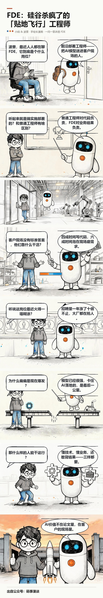
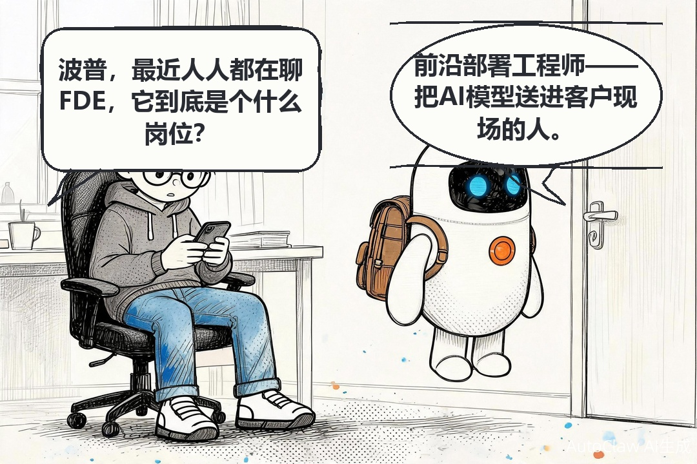

# comic-maker

[](https://github.com/aiyinluya/comic-maker/actions/workflows/smoke.yml)

一问一答的手绘科普长漫画流水线。先看产出——这是用它做的第一期：



这是「码事漫谈」漫画专栏的生产工具。每期漫画讲一个 AI 概念（幻觉、机器学习、FDE……），由固定角色提问者和解答者一问一答推进，最后拼成一张竖版长图，粘进公众号就能发。

## 为什么有这个仓库

用 AI 画漫画的人都撞过这三堵墙：

1. **中文气泡乱码**。「参数」画成「修数」，整句变成鬼画符，越修越错；
2. **文字溢出气泡**。字排到气泡框外面去了；
3. **字号忽大忽小**。同一个工具出的图，这格字大那格字小。

我们用「生成气泡 + 代码擦字重排」的思路修了五个版本，每版都能解决一部分，又冒出新问题。全部过程记在 [docs/ROOT-CAUSES.md](docs/ROOT-CAUSES.md)，十六条根因，条条都是真实事故。

最后得到的结论很简单：**只要气泡是模型画的，这些毛病就只能缓解，不能根治。** 因为模型的气泡没有几何保证——你拿到的只是一张图，文字要排到哪里，全靠猜。

所以这个仓库换了条路：**生成模型只画画面，气泡和文字用代码画。**

- 画面：模型出「无气泡、无文字」的场景图，角色靠定妆照保持一致；
- 气泡：Pillow 画圆角矩形（提问者）和椭圆锯齿尾（解答者），描边加了微小抖动模拟手绘笔触；
- 文字：统一字号档位渲染，气泡高度由文字需求反推。

文字是程序渲染的，乱码从根上不存在；气泡和文字在同一个坐标系里，溢出在几何上不成立；字号是全局统一档位，大小只可能一致。

## 现在它不只是一个脚本

围绕这条流水线，配套工具已经长齐了：

| 能力 | 脚本 | 说明 |
|---|---|---|
| 分镜单一事实源 | `parse_storyboard.py` | 从 storyboard.md 直接解析出气泡配置，draw_bubbles `--bubbles` 直读 |
| 出图质检 | `lint.py` | 气泡越界 / 字号档位统一 / 角色要素三检查，CI 可跑 |
| 文章转分镜 | `article_to_storyboard.py` | 已有科普文章一键转分镜草稿 |
| 修字闭环 | `fix_panel.py` | OCR 比对 → 整句重写 → 两轮失败转程序化改字 |
| 本地定妆照 | `gen_panel.py --ref-local` | 本地参考图自动上传 OSS，不用手动传图床 |
| 并行出图 | `batch_parallel.py` | 线程池批量出格，断点续跑，逐格重试 |
| 风格资产化 | `styles/manshi.yaml` | 画风 DNA、角色标记、气泡参数、拼装尺寸集中定义 |
| 角色设定集 | `gen_sheets.py` | 表情表 / 动作表 / 转面图一键生成（见 assets/characters/） |
| 漫画博客生成 | `gen_blog.py` | 分镜成品 → 三版博客（MD / 杂志 HTML / 公众号复制版）；`--format panels\|long` 选单格图文交错或长图单图版 |
| 水印清理 | `strip_watermark.py` | 跨图中值掩膜 + inpaint 清除网关白色水印（R19），掩膜自动缓存复用 |

全部 19 部成品长图和 6 篇同源文章在 [output/index.html](output/index.html) 总索引页浏览。

## 流水线

```
1. 文案      联网查资料，写分镜脚本，先给人看，确认了才开画
2. 定妆照    角色设定集立绘，画一次存档，之后每格都拿它当参考图
3. 空场景    文生图出「没有气泡没有文字」的画面（角色用参考图锁定）
4. 质检      识别模型查角色要素、有没有混进意外文字
5. 绘泡      draw_bubbles.py 画气泡和台词，字号全局统一
6. 拼装      stack.py 加标题区和页脚，竖排成 1080px 长图
```

定妆照长这样（也是流水线自己生成的）：



## 用法

```bash
pip install pillow numpy

# 登记角色
python scripts/comic.py ensure-character --name 小码 --slug xiaoke \
  --role 提问者 --markers "黑色短发，圆框眼镜，深灰连帽衫"

# 空场景出格（提示词里禁止出现气泡和文字，这句是硬约束）
python scripts/gen_panel.py "<场景提示词>" "<定妆照URL>" --raw panels/01.raw.jpg

# 画气泡和文字（分镜 md 是单一事实源，推荐）
python scripts/parse_storyboard.py --storyboard storyboard.md --out bubbles.json
python scripts/draw_bubbles.py --bubbles bubbles.json --dir panels/

# 出图后跑质检（越界/字号/角色要素）
python scripts/lint.py --config examples/bubbles.example.json

# 或者传统方式：气泡位置、台词手写在 JSON 里
python scripts/draw_bubbles.py --config examples/bubbles.example.json

# 拼长图
python scripts/stack.py --config stack.json
```

图像生成后端不绑定服务商，OpenAI 兼容 API、ComfyUI、AutoGLM 都能接，改一个适配脚本就行，见 [docs/INTEGRATION.md](docs/INTEGRATION.md)。

## 目录

```
output/                        ★ 最终成品（发布即用）
  index.html                   19 部作品总索引页（本地打开即用）
  long-form/                   19 部竖版长图，按作品编号命名
    01-mcp/01-mcp.png          主图（PNG）+ -share.jpg 轻量分享版
    ...
  panels/                      单格成品图（按作品分子目录，供按格发布/博客用）
stories/                       ★ 19 部作品的复现分镜包（每话 storyboard.md）
articles/                      6 篇同源科普文章 + 索引 / 术语表 / 台账
assets/characters/             定妆照 + 表情表 / 动作表 / 转面图
data/characters/               角色档案（comic.py 数据落点，COMIC_DATA 可改）
styles/                        画风 DNA 参数化（manshi.yaml，--style 消费）
scripts/
  draw_bubbles.py    气泡与文字绘制（本仓库的核心，支持 --style）
  parse_storyboard.py  分镜 md → 气泡配置（单一事实源）
  lint.py            出图质检（越界 / 字号 / 要素）
  gen_panel.py       空场景出格（--ref-local / COMIC_SEEDREAM 等环境变量可配）
  batch_parallel.py  并行批量出格（线程池 + 断点续跑）
  gen_sheets.py      角色设定集三表生成
  article_to_storyboard.py  文章 → 分镜草稿
  fix_panel.py       修字闭环（OCR → 重写 → 转程序化）
  comic.py           角色档案、定妆照登记（数据落 data/，COMIC_DATA 可改）
  stack.py           长图拼装
  patch_text.py      单气泡改字（微调用）
docs/
  ROOT-CAUSES.md     十六条根因登记表，本仓库最值得读的文件
  INTEGRATION.md     图像后端、字体、发布平台适配
SKILL.md             Agent 技能规范（v2.8 九步流水线）
CONTRIBUTING.md     贡献指南（两条铁律 + 自检清单）
CHANGELOG.md         版本日志（v2.6 起）
optimizations.md     工程化优化台账（勾选 + 证据）
examples/            可直接运行的示例
```

过程与成品分离：`output/` 里的每一张图都可直接发布；每部作品的过程图
（空场景 raw / 修字轮次）留在工作目录不进库，台账类纯文字（LEDGER /
MANIFEST / DECISIONS）保留在 `posts/` 供追溯。

## 给想改代码的人

两条规矩：

1. 气泡文字的字体、字号、颜色、行距只在 `draw_bubbles.py` 顶部的常量表里定义一次，别处不许碰。样式漂移是我们踩过最深的坑（R14）；2. 每次翻车都在 [ROOT-CAUSES.md](docs/ROOT-CAUSES.md) 补一条：症状是什么、根因是什么、在哪改的。改完代码不登记，等于没修。

## License

[MIT](LICENSE) · 李卓 · 公众号「码事漫谈」
