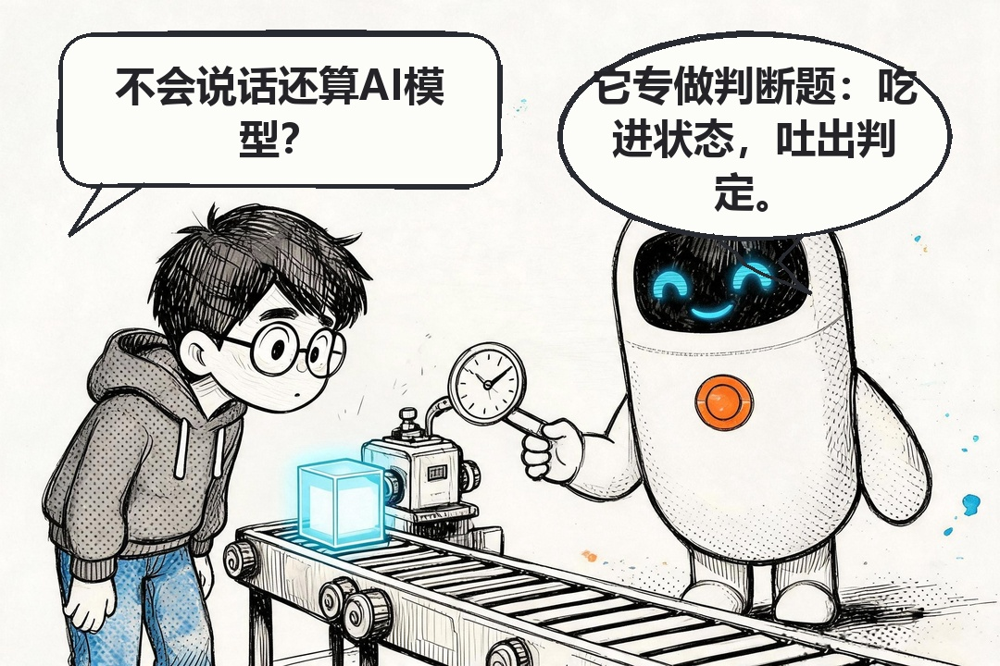
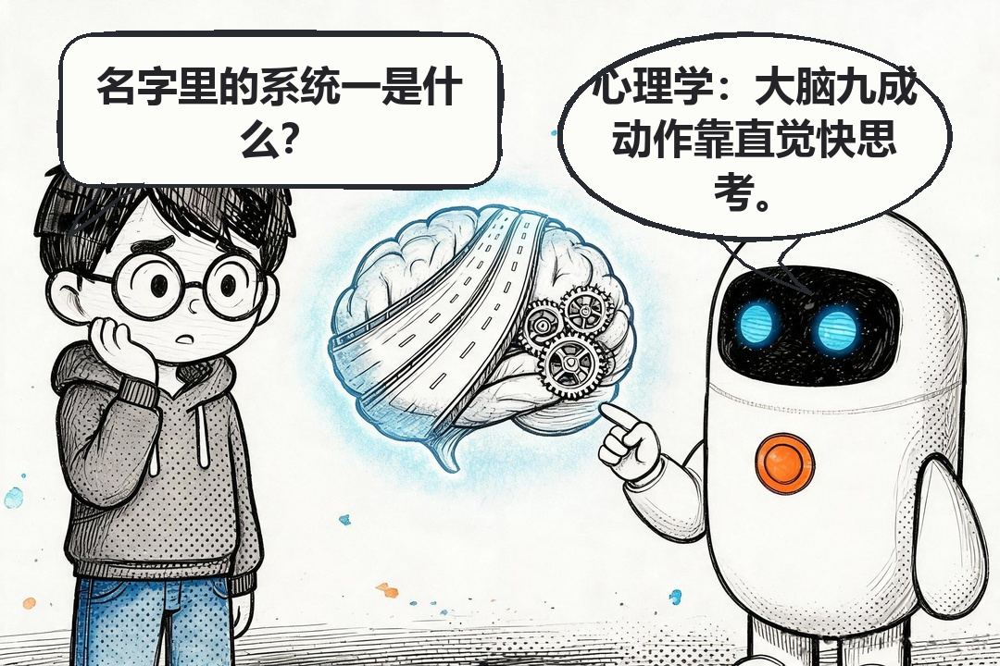
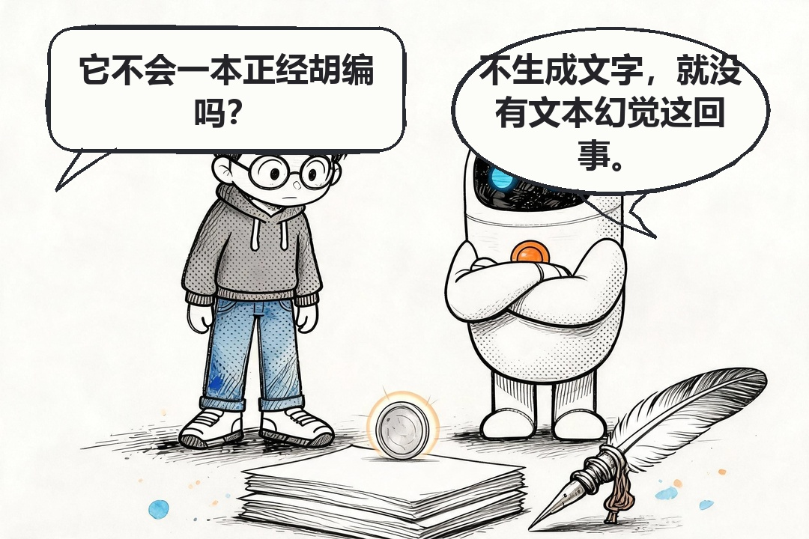
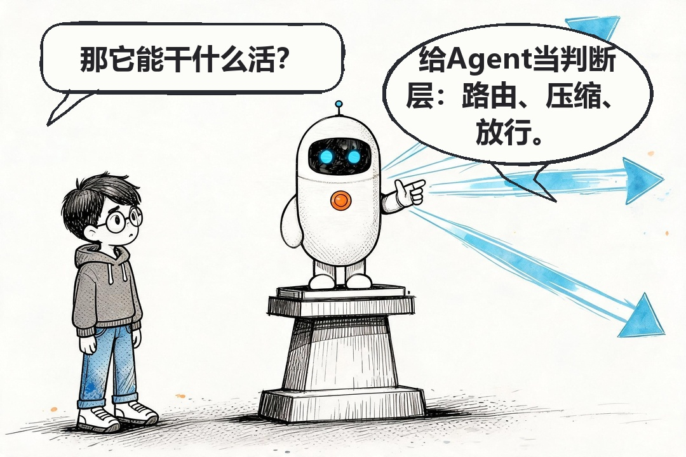

# 不说话的 AI：Jev 与它的判断题

> 码事漫谈 · AI 科普第 21 话 · 2026-09-22

> 配套漫画《不说话的 AI：Jev 与它的判断题》 · [完整长图](../output/long-form/21-jev/21-jev.png)

> 码事漫谈 · AI 科普第 21 话 · 2026-09-22

> 配套漫画《不说话的 AI：Jev 与它的判断题》 · [完整长图](../output/long-form/21-jev/21-jev.png)

## 引入

9 月 15 日，一家叫 TypeSafe AI 的公司发布了个新模型，名字叫 Jev。它不聊天，不写代码，不写文章，你问它任何开放性问题，它都不会搭理你。

但它火了。前 OpenAI 研究员 Diogo Almeida 创办的这家公司，给 Jev 起了个新类别名：System One Model，系统一模型。发布几天内，相关讨论刷遍了开发者社区。

一个不说话的 AI，凭什么？

## 它只做判断题

传统大模型的输出是一段一段的文字。Jev 的输出没有文字：你给它一份状态数据（state），再加一组提前定义好的问题，它直接吐出结构化的判定结果，附带一个概率。程序拿来就能用，不需要解析自然语言。

打个比方。LLM 像一个博学的顾问，你问他"这个邮件该不该发"，他给你写三段分析，最后加一句"建议发送，但也要看具体情况"。Jev 像一个路口的信号灯：状态进来，红色或绿色出来，概率写在灯杆上。

名字不是白起的。卡尼曼在《思考，快与慢》里把人的思维分成两套：系统一快而直觉，负责九成日常判断——躲开障碍、认出熟人、觉得哪里不对劲；系统二慢而费力，负责解数学题、写报告。TypeSafe 的说法是：ChatGPT 那样的生成模型像系统二，又慢又贵；Jev 想当系统一。

## 快，官方说快两百倍

性能数据全部来自 TypeSafe 自己的口径：端到端响应 70 到 500 毫秒；同等智能水平下，这类判断查询比 LLM 快 40 到 200 倍。

这个数字要打个标——论文还没公开，参数规模、网络结构、训练数据一概没披露，36 氪的标题就直接在问"Jev 真是新范式吗"。但方向本身不难理解：判断题和生成题本来就是两种活，让一个不负责写作文的模型去判断"这个状态有没有异常"，省掉生成文字的开销，快是应该的。

关于幻觉，他们的说法更直接：Jev 不生成文字，所以文本幻觉在结构上就不存在。输出被限制在预定义的判定集合里，程序要么拿到一个合法判定，要么拿到报错。传统 LLM 即便被提示输出置信度，也普遍过度自信、前后不一致——这是 TypeSafe 引的对比，他们管自己的训练方法叫 RLCD，面向校准决策的强化学习。

## 它想站在 Agent 的马路中间

Jev 的目标场景不是跟你聊天，是塞进软件系统里。TypeSafe 点了三个用法：Agent 路由（这个请求该交给哪个模型处理）、上下文压缩（这堆信息里哪些值得保留）、操作放行（这一步该不该执行）。

思路是对的。现在的 Agent 大量算力花在"问 LLM 一个判断题"上：这步对不对、要不要重试、这段上下文还重不重要。这些判断如果真能用几十毫秒、低成本、带校准概率的专用模型做掉，Agent 的速度和成本都会改观。大模型负责惊艳，判断模型负责可靠，各干各的。

## 现在该怎么看

我的看法：当方向看，别当结论看。

方向是合理的——AI 的下一步不全是"更大的生成模型"，判断专用、校准概率、结构化输出，这条路对 Agent 工程师很实际。但证据还薄：论文没发，基准是自报的，"消灭幻觉"这种话在 AI 行业历史上向来要打折听。

所以值得试，也值得等。等论文、等第三方复现、等真实 Agent 系统里跑出来的数据。

---

*事实依据：TypeSafe AI 官方发布口径，经 36 氪《一个"不说话"的 AI 刷屏，Jev 真是新范式吗？》、OSCHINA、新浪科技、知乎技术社区等多源交叉（2026-09-15 至 09-22）。性能数据均为 TypeSafe 官方口径，第三方验证尚未见。*

**出自公众号：码事漫谈**

---

**出自公众号：码事漫谈**

---

**出自公众号：码事漫谈**
